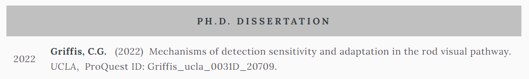

# khrisgriffis.com

This is the backend for my personal website.

---
_Dependencies_


---

I modified this from the repo for [arkadianriver.com](https://github.com/arkadianriver/arkadianriver.com), which is based on the awesome design of http://html5up.net/spectral by the talented [@ajlkn](http://twitter.com/ajlkn). Gary ([@arkadianriver](https://twitter.com/arkadianriver)) did a fantastic job porting the theme template into a [Jekyll](https://jekyllrb.com/)-based static site generator, and I've made only a few modifications of my own. Unlike modern Jekyll themes, which function as plugins, this port is more like a templated site.

## First Steps

_If you decide you want to use this theme._

Much of the functionality is the same as [arkadianriver.com](https://github.com/arkadianriver/arkadianriver.com) with a few inclusions that allowed me to turn the portfolio into a digitical CV/resume. To this end, I incorporated a simple timeline from [materializecss](https://www.um.es/docencia/barzana/materializecss/cards.html) cards into an "Experiences" page, as well as a "Publications" page that parses posts with the category "publications" into a table. Lastly, I moved the blog entries into a "Missives" heading.

You can clone/fork the `clean` branch of this repo and use the [custom actions](https://github.com/Khlick/khlick.github.io/tree/live/.github) to build and deploy your site on your own github pages (described in [Build](./README.md#Build)), or use any other methods for building and hosting your site. If you use the custom workflow, you can add your markdown posts to the `./_posts` directory and push to the `live` branch. If you change the name of the branch you want to host from, you'll also have to change the workflow triggers (again, see [Build](./README.md#Build)). The build process will create a `github-pages` environment and your deployed site will be hosted from the `./_site` directory.

## Configuration

1. Personalize the information in the [YAML files](http://www.yaml.org/start.html).
   - Start with setting up your author information in `./_data/authors.yml` file.
  Here, you'll want to set a YAML list with your desired author key, I just chose my name. Then you'll set some key fields for `name`, `bio`, `url`, and `avatar`, as shwon in the example below:  
    ```yaml
    khrisgriffis:
      name: Khris Griffis
      bio: >
        Neurophysiology | Statistics | Biosignals Analysis | Data Science
      url: https://khrisgriffis.com
      avatar: kgriffis.jpg
    ```
   - If you wish to include your own google analytics tracking, or add extra site variables for your own customization, edit the `./_data/tokens.yml` accordingly.
   - Edit the `./_config.yml` for Jekyll. This file contains all your site information (see [Jekyll Configuration](https://jekyllrb.com/docs/configuration/)) along with a few custom configurations for this theme.  
  
    Config | Purpose
    -----|-------
    `siteauthor` | The site's author, a keyword matching the first key in `./_data/authors.yml`.
    `landing-image` | Name of the landing page's background image file.
    `rambleimg` | Name of the image file for the `missives` category.
    `pubimg` | Name of the image file for the `publications` category.
    `expimg` | name of the image file for the `experiences` category.
    `greeting.title` | Title string for the greetings section of the landing page. The greetings section contains the social links.
    `greeting.text` | Text to display below the title and above the social icons.
    `closing-head` | Title string to display above the footer of the site.
    `closing-para` | Text to display below the closing head. _Note: this section also contains a `mailto: site.data.authors[site.siteauthor]`._
    Table 1. _Selection of custom configurations for this theme. Note: for all images, the names of the files should omit the directory, unless the directory is a sub-directory of `./images`, e.g. put `"sub/img.jpg"` for a file in `./images/sub`. Also, image names here will be ignored by pages with `image` and `background-image` header tags._
   - Personalize the images with your own, and change the attribution for your new banner at the bottom of `_data/credits.yml`.

    File | Action
    -----|-------
    **`_data/authors.yml`** | Site author(s) information. Set main author as first in the list.
    **`_data/tokens.yml`** | A collection of site variables and extra tokens.
    **`_data/credits.yml`** | Credits and attributions to populate the credits page.
    **`_config.yml`** | Configurations for Jekyll, Jekyll plugins and site information.
    Table 2. _Personalizable files and their general purpose._


## Build

Initially, I struggled to get any of the available github workflows to build and deploy the site. With Ruby (3.2.1), RubyGems and Jekyll (4.3.2) installed, I was able to create a github workflow and custom action to parse the site, which includes the unsupported [jekyll-scholar](https://github.com/inukshuk/jekyll-scholar) plugin for a scientific feel for posts. A quick google search returned numerous ways of bypassing using unsupported Jekyll plugins, but I didn't want to have to maintain 2 branches for the site, nor did I want to upload the built site and the backend repo every push. For small sites, and certainly my personal site is one, that process is manageable, but not ideal. So, I built a custom github action and wrote a workflow directive that listens for a push (not a PR merge, though) to the `live` branch and executes a build and deploy of the site. For my site, there is about a 1 minute delay between push update and the deployment update. 

On the local side, you can use Jekyll commands to build your site, or serve your site, so you do not have to push to github for testing/viewing your changes/posts.

## TODO: 

_More to come on this readme!_

- Include procedure for setting up github actions with this site.
- Include post examples for `experiences`, `publications`, and `missives` categories.
- Include Liquid examples for using page headers in posts.


## Posts And Pages

Other than the landing page, the site generates 3 other content pages, and the credits page. The credits page is generated from the yaml content of the `./_data/credits.yml` file. [Correctly named](https://jekyllrb.com/docs/posts/) markdown files placed in the `./_posts` directory may be one of the following categories:

- `publications`
- `experiences`
- `missives`

Generally, all posts follow the [default layout](./_layouts/default.html), and thus require a few key elements in the YAML header.

KEY | VALUE | REQUIREMENT
----|-------|------------
`author` | Key name in `./_data/authors.yml` list, empty, or `'none'`. Setting this adds author blob. | _optional_
`date` | Desired publication date in the format: `YYYY-MM-DD HH:mm:ss -0700`. | _required, must match post name prefix_
`title` | Post title, parsing depends on category. | _required_
`excerpt` | Short summary or description, or blank (preferred in most cases). | _optional_ 
`categories` | Scalar array of `experiences`, `publications`, or `missives`. | _required_
`tags` | List of tags and keywords associated with post contents. | _recommended_
`options` | List of options to apply to pages, only `minihead` is implemented at present. | _optional_

### Publications

Publication posts were designed with the idea of creating a table like the Google Scholar (r) profile page. Each post marked with the `publications` category could contain a snippet of the manuscript, the manuscript in its entirety, commentary on the manuscript, list of sources or key points... Really, you can put anything you want on these posts. I have used them to show the abstract and a link. I did the best I could to make the YAML keywords for parsing the reference like keywords from bibtex files. Below is the example header for my Ph.D. thesis:
```yaml
---
author: none
date: 2022-05-25 01:01:01 -0700
options:
 - minihead
title: Mechanisms of detection sensitivity and adaptation in the rod visual pathway
excerpt:
type: 2-dissertation-thesis
type-label: Ph.D. Dissertation
categories:
  - publications
pubauthor:
  - family: Griffis
    given: Christopher G
author-highlight: Griffis
pub-date: 2022
published-in: UCLA
volume: false
page:  "ProQuest ID: Griffis_ucla_0031D_20709"
exturl: 'https://escholarship.org/uc/item/4tt400wt'
tags:
  - visual neuroscience
  - electrophysiology
  - photon detection
  - adaptation
  - dynamical modeling
  - software design
---
```

The above header is rendered on the `Publications.html` page as:



### Experiences

Experiences posts were designed to act like the Education or Experience sections on a resume. The post itself should contain the duties or tasks assigned during the time period designated in the YAML header. The additional fields required by Experiences posts are as follows:

KEY | VALUE | REQUIREMENT
----|-------|------------
`title` | Name of the position held. | _required_
`location` | Place of work or institution. | _required_
`date` | Either start date of employment if `enddate` is not blank, or terminal date if `enddate` is Nil. | _required_
`enddate` | End date of employment or leave blank. | _optional_

Type job description or information about the entry in the body of the post. These posts should be very short. I mostly use bulleted items or a short paragraph.


### Missives

KEY | VALUE | REQUIREMENT
----|-------|------------
`author` | Key name in `./_data/authors.yml` list. Setting this adds author blob. | _optional_
`title` | Title name of the post. | _required_
`excerpt` | Short summary or description. | _optional_ 

_TODO: example of jekyll-scholar, see: https://www.amirasiaee.com/dailyreport/jekyll-scholar/_